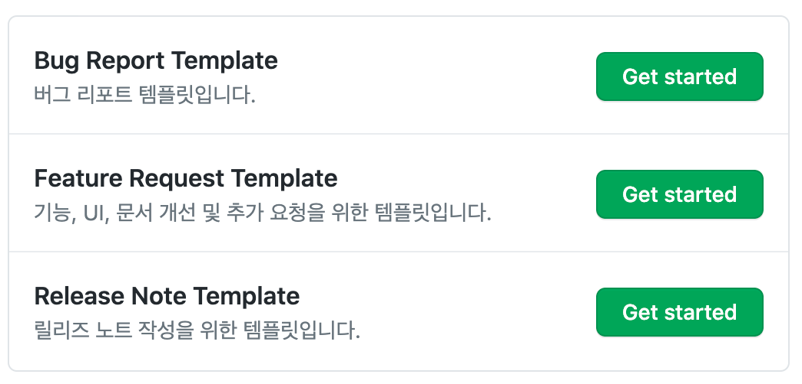
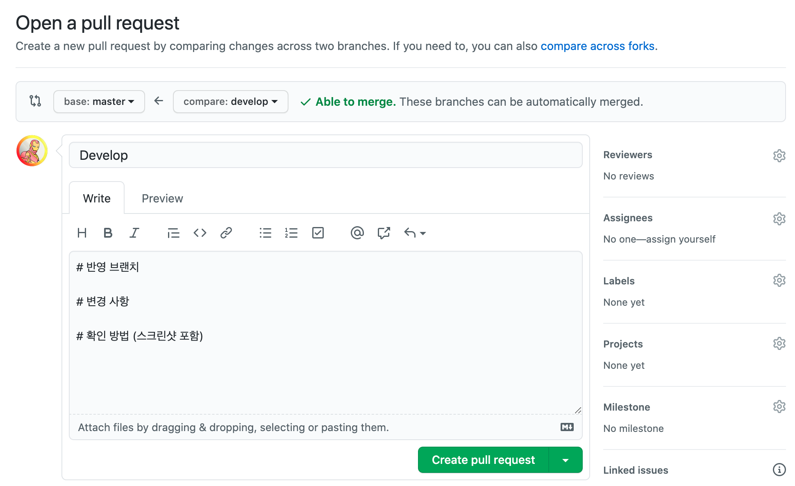

# CrepeX repository 형식 관리용 저장소

> 이 저장소의 이슈/풀리퀘스트 템플릿은 조직 내 저장소 모두에게 적용됨. 하위 저장소 템플릿이 있는 경우 하위 템플릿을 우선함.
> workflow 는 하위 저장소에서 끌어쓸 수 있게 정의되어 있음.

---

## Issue Template

`Issues` 탭에서 `New issue` 버튼을 눌렀을 때 미리 정의 된 템플릿을 선택할 수 있음


### Issue Template 정의하기

- 마크다운 형식으로 파일 생성
- `name`, `about`, `title`, `labels`, `assignees`를 미리 지정할 수 있음
- labels 의 경우 위에서 정의 한 label name을 지정하면 됨

### 예시

```markdown
---
name: Hotfix Template
about: Hotfix가 필요한 작업에 대한 템플릿입니다. 브랜치명은 hotfix/#number 로 맞춰주세요.
title: 'hotfix: '
labels: 'status/critical'
assignees: ''
---

## 설명

어떤 문제가 있는지 명확하게 설명해주세요.

## 작업 예정사항
```

---

## Pull Request Template

- 마크다운 형식으로 파일 생성
- `PULL_REQUEST_TEMPLATE.md`로 파일 이름 지정

### Pull Request Template 적용



---

## Workflow

### 호출 가능한 공유 workflow 생성

```yml
# filename: example.yml

name: Example action

on:
  # 실제 action에 전달될 input, secrect을 정의함
  workflow_call:
    inputs:
      username:
        required: true
        type: string
    secrets:
      token:
        required: true

jobs:
  build:
    runs-on: ubuntu-latest

    steps:
      - uses: other/action-repo@v3
        with:
          username: ${{ inputs.username }}
        env:
          GITHUB_TOKEN: '${{ secrets.token }}'
```

### 하위 저장소에서 공유 workflow의 사용

```yml
name: Example action caller
on:
  # 실제 트리거 조건
  push:
    branches:
      - main
jobs:
  call_example_action:
    uses: crepex/.github/.github/workflows/example.yml@main
    with:
      username: 'hey'
    secrets:
      token: '${{ secrets.GITHUB_TOKEN }}'
```

### 병합 후 브랜치 삭제 workflow의 사용

- 설정은 `delete-merged-branch-config.yml` 에 정의됨.
- pull request closed webhook 에 의해 작동

```yml
name: delete branch on close pr
on:
  pull_request:
    types: [closed]

jobs:
  delete-branch:
    runs-on: ubuntu-latest
    steps:
      - name: delete branch
        uses: SvanBoxel/delete-merged-branch@main
        env:
          GITHUB_TOKEN: ${{ secrets.GITHUB_TOKEN }}
```

# 참고

- [organization-workflow](https://docs.github.com/en/actions/using-workflows/sharing-workflows-secrets-and-runners-with-your-organization)
- [Using templates to encourage useful issues and pull requests](https://docs.github.com/en/free-pro-team@latest/github/building-a-strong-community/using-templates-to-encourage-useful-issues-and-pull-requests)
